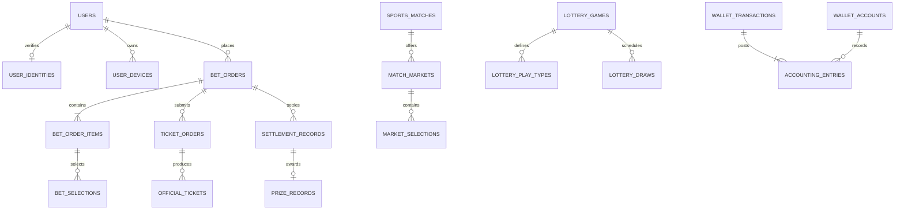
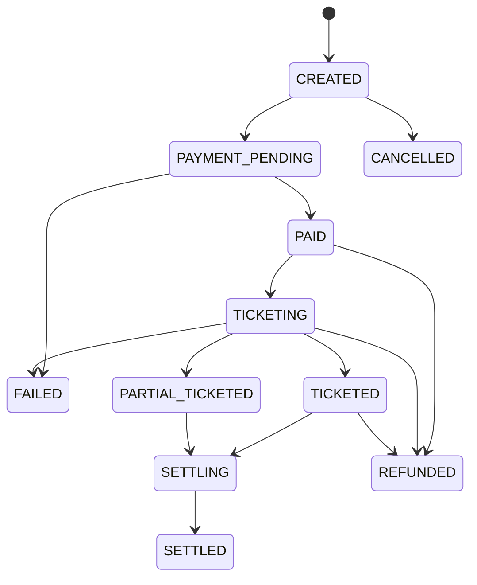

# 数据库设计

数据库使用 PostgreSQL，首版迁移位于 `server/src/main/resources/db/migration/V1__baseline.sql`，基础彩种数据位于 `V2__seed_catalog.sql`。

## 设计原则

- 所有金额均使用 `bigint`，单位为“分”；赔率使用 `numeric(12,4)`，金额禁止使用浮点数。
- 用户手机号、姓名、证件号、银行卡令牌只保存密文；查询和去重使用不可逆哈希，日志不得记录明文。
- 下单、充值、提现、出票、派奖均有业务幂等键，网络重试不能产生重复订单或重复入账。
- 钱包使用分户账和双边分录。业务表描述业务事实，`wallet_transactions` 与 `accounting_entries` 是账务事实。
- 已入账的分录不可修改或删除；交易入账前由数据库触发器校验借贷金额相等。
- 高频更新表使用 `version` 做乐观锁；状态改变写入历史或审计表，不覆盖证据。
- 时间统一保存 `timestamptz`，接口统一输出 ISO-8601；彩期额外保存官方 `issue_no`。

## 领域关系

## 表分组

| 模块 | 核心表 | 关键约束 |
| --- | --- | --- |
| 账户与合规 | `users`, `user_identities`, `user_devices`, `auth_sessions`, `user_bank_cards`, `user_risk_profiles` | 用户号、手机号哈希、证件哈希唯一；实名和年龄独立审核 |
| 彩种与开奖 | `lottery_games`, `lottery_play_types`, `lottery_draws`, `lottery_draw_numbers` | 彩种编码唯一；彩期按彩种和期号唯一；销售截止不晚于开奖 |
| 赛事与赔率 | `sports_competitions`, `sports_teams`, `sports_matches`, `match_markets`, `market_selections`, `odds_snapshots` | 官方赛事 ID 唯一；球队队徽有来源与校验值；赔率只追加快照 |
| 投注与出票 | `bet_orders`, `bet_order_items`, `bet_selections`, `ticket_orders`, `official_tickets`, `order_status_histories` | 用户请求幂等；订单总额和明细可核对；官方票号唯一 |
| 追号与关注 | `chase_plans`, `chase_plan_issues`, `user_favorites` | 每期追号只能生成一个订单；停止追号不影响已出票订单 |
| 钱包与支付 | `wallet_accounts`, `wallet_transactions`, `accounting_entries`, `recharge_orders`, `payment_callbacks`, `withdrawal_orders` | 借贷平衡；入账分录不可变；支付回调去重 |
| 结算 | `settlement_jobs`, `settlement_records`, `prize_records`, `refund_records` | 结算任务幂等；同一结算明细不可重复派奖 |
| 风控与运营 | `risk_rules`, `risk_events`, `manual_reviews`, `notifications`, `user_notifications`, `responsible_gaming_limits`, `self_exclusions`, `audit_logs`, `operation_logs` | 风控决策可追溯；自我排除和限额进入下单前置校验 |
| 会员与内容 | `coupon_templates`, `user_coupons`, `referral_codes`, `referral_rewards`, `user_growth_accounts`, `user_growth_entries`, `help_articles` | 优惠券锁定后才能抵扣；成长值和邀请奖励保留不可覆盖的流水 |

## 钱包分录

| 业务 | 借方 | 贷方 |
| --- | --- | --- |
| 充值到账 | 支付待结算账户 | 用户可用账户 |
| 投注冻结 | 用户可用账户 | 投注冻结账户 |
| 出票成功 | 投注冻结账户 | 彩票销售账户 |
| 出票失败 | 投注冻结账户 | 用户可用账户 |
| 派奖 | 奖金结算账户 | 用户奖金账户 |
| 提现申请 | 用户奖金账户 | 提现冻结账户 |

每一笔账务操作应在同一个数据库事务中完成：创建 `PENDING` 交易、锁定账户、写入至少两条分录、更新账户余额、最后将交易改为 `POSTED`。数据库在最后一步校验借贷平衡。

## 订单状态机

状态跳转必须通过领域服务完成，并同步写入 `order_status_histories`。`FAILED`、`CANCELLED`、`SETTLED`、`REFUNDED` 是终态。
